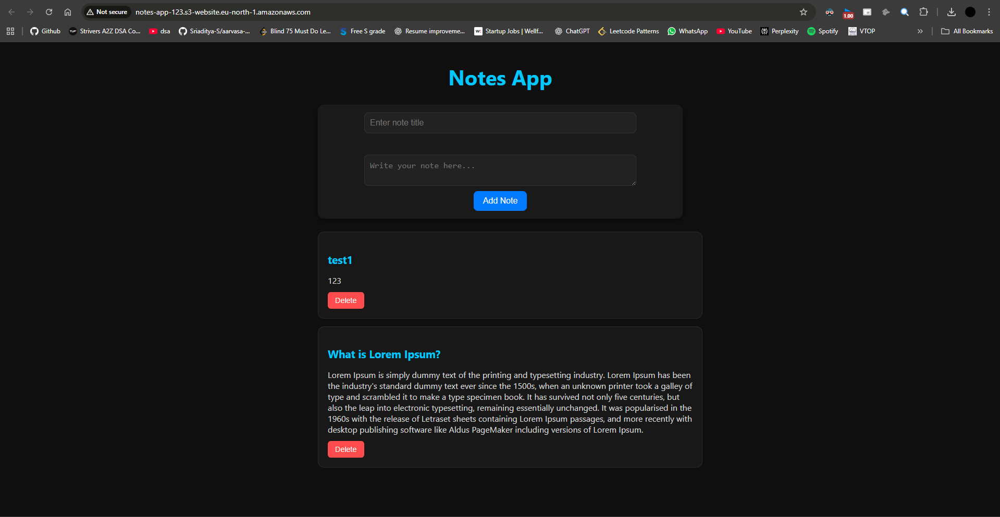
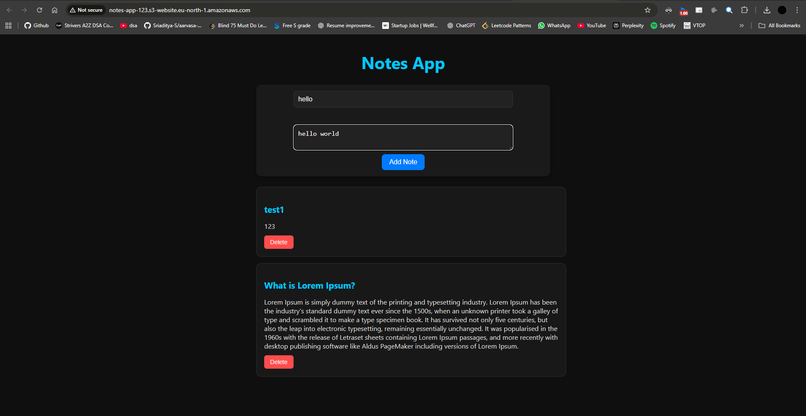
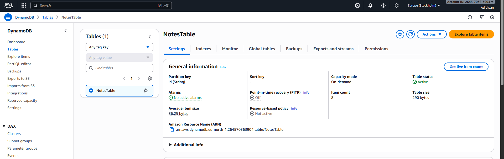
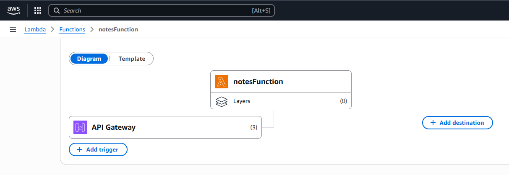
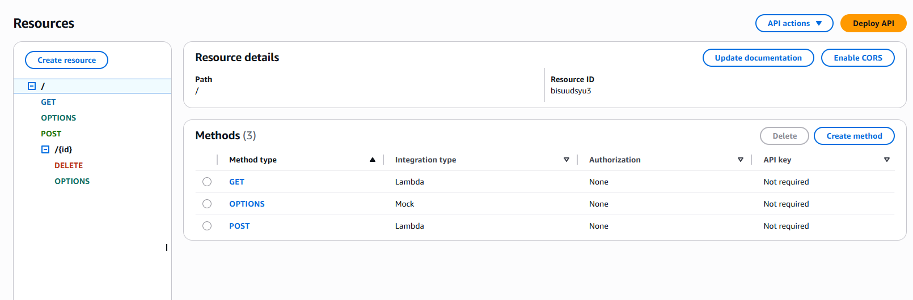
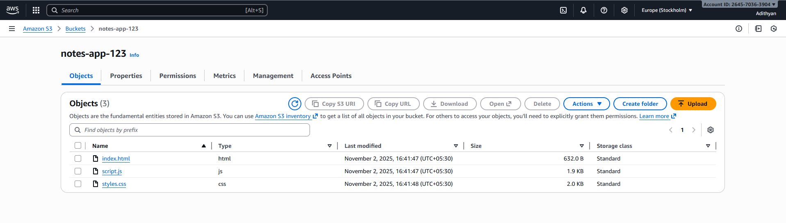

# 📘 AWS Notes App – Serverless Web Application

A fully serverless web application built using AWS Free Tier services that enables users to create, view, and delete notes seamlessly in the cloud.

---

## ✅ Project Overview

The **AWS Notes App** is a modern, serverless web application designed to demonstrate cloud-native architecture using AWS services. It leverages the power of AWS Lambda, DynamoDB, API Gateway, and S3 to deliver a scalable, cost-effective, and fully managed solution without requiring traditional backend servers.

### 🎯 Key Highlights
- **100% Serverless** – No server management required
- **Cost-Effective** – Built entirely using AWS Free Tier
- **Scalable** – Automatically scales with demand
- **Secure** – IAM-based access control
- **Modern UI** – Responsive design with dark theme

---


## 🏗️ Architecture Diagram

```
┌─────────────────────────────────────────┐
│   Frontend (S3 Static Website)          │
│   • index.html                           │
│   • styles.css                           │
│   • script.js                            │
└────────────────┬────────────────────────┘
                 │ HTTPS
                 ↓
┌────────────────────────────────────────┐
│   API Gateway (REST API)                │
│   • GET /notes                          │
│   • POST /notes                         │
│   • DELETE /notes/{id}                  │
└────────────────┬───────────────────────┘
                 │
                 ↓
┌────────────────────────────────────────┐
│   AWS Lambda Function                   │
│   • Node.js Runtime                     │
│   • Business Logic                      │
└────────────────┬───────────────────────┘
                 │
                 ↓
┌────────────────────────────────────────┐
│   Amazon DynamoDB                       │
│   • NotesTable                          │
│   • Primary Key: id                     │
└────────────────────────────────────────┘
```

---

## ⚙️ AWS Services Used

| Service | Purpose |
|---------|---------|
| **Amazon S3** | Hosts the static frontend (HTML, CSS, JavaScript) |
| **API Gateway** | Exposes REST endpoints (`/notes`, `/notes/{id}`) |
| **AWS Lambda** | Executes backend logic without server management |
| **Amazon DynamoDB** | NoSQL database for storing notes |
| **IAM Roles & Policies** | Secure access control between services |
| **AWS CloudWatch** | Monitors logs and tracks function executions |

---

## 🚀 Features

- ✅ **Create Notes** – Add new notes with title and content
- ✅ **View All Notes** – Display all saved notes in a clean interface
- ✅ **Delete Notes** – Remove unwanted notes with one click
- ✅ **Responsive Design** – Works seamlessly on desktop and mobile
- ✅ **Public Access** – Hosted on AWS S3 with public URL
- ✅ **CORS Enabled** – Secure cross-origin API calls
- ✅ **Real-time Updates** – Instant synchronization with DynamoDB

---

## 🛢️ DynamoDB Table Structure

**Table Name:** `NotesTable`

| Attribute | Type | Description |
|-----------|------|-------------|
| `id` | String (Primary Key) | Unique identifier for each note (UUID) |
| `title` | String | Title of the note |
| `note` | String | Content/body of the note |

---

## 🌐 API Endpoints

| Method | Endpoint | Description | Request Body |
|--------|----------|-------------|--------------|
| `GET` | `/notes` | Fetch all notes | N/A |
| `POST` | `/notes` | Create a new note | `{ "title": "string", "note": "string" }` |
| `DELETE` | `/notes/{id}` | Delete a specific note | N/A |


---

## 💻 Project Structure

```
aws-notes-app/
│
├── frontend/
│   ├── index.html          # Main HTML structure
│   ├── styles.css          # Modern dark theme styling
│   └── script.js           # API integration & DOM manipulation
│
├── lambda/
│   └── index.mjs           # Lambda function code (Node.js)
│
├── screenshots/            # Project screenshots
│
└── README.md              # This file
```

---

## 🌍 Live Application

🔗 **Hosted Website:** [http://notes-app-123.s3-website.eu-north-1.amazonaws.com/](http://notes-app-123.s3-website.eu-north-1.amazonaws.com/)

---

## 📸 Screenshots

### Home Page – Notes Interface

*Main interface showing all notes with add and delete functionality*

### Adding a New Note

*Modal dialog for creating a new note*

### DynamoDB Table

*NotesTable in DynamoDB console showing stored notes*

### AWS Lambda Function

*Lambda function configuration and code editor*

### API Gateway Configuration

*REST API endpoints and methods*

### S3 Static Website Hosting

*S3 bucket configuration for static website hosting*

---

## 📦 Installation & Deployment

### Prerequisites
- AWS Account (Free Tier eligible)
- Basic knowledge of AWS Console
- Text editor for code modification

### Step 1: Create DynamoDB Table
1. Navigate to **DynamoDB** in AWS Console
2. Click **Create table**
3. Set **Table name**: `NotesTable`
4. Set **Partition key**: `id` (String)
5. Use default settings and create table

### Step 2: Create Lambda Function
1. Go to **AWS Lambda** console
2. Click **Create function**
3. Choose **Author from scratch**
4. Set **Function name**: `NotesFunction`
5. Choose **Runtime**: Node.js 18.x or later
6. Create function and paste the backend code from `lambda/index.mjs`

### Step 3: Configure IAM Role
1. In Lambda function, go to **Configuration** → **Permissions**
2. Click on the execution role
3. Attach policy: `AmazonDynamoDBFullAccess` (or create custom policy)

### Step 4: Setup API Gateway
1. Navigate to **API Gateway** console
2. Create **REST API**
3. Create resource `/notes`
4. Create methods: `GET`, `POST`
5. Create resource `/notes/{id}` with `DELETE` method
6. Link each method to Lambda function
7. **Enable CORS** for all methods
8. Deploy API to a stage (e.g., `prod`)
9. Note the **Invoke URL**

### Step 5: Configure Frontend
1. Open `script.js`
2. Replace `API_URL` with your API Gateway Invoke URL
3. Save the file

### Step 6: Deploy to S3
1. Go to **S3** console
2. Create bucket (e.g., `notes-app-123`)
3. Upload `index.html`, `styles.css`, `script.js`
4. Go to **Properties** → **Static website hosting**
5. Enable static website hosting
6. Set **Index document**: `index.html`
7. Go to **Permissions** → **Bucket Policy**
8. Add public read policy:
```json
{
  "Version": "2012-10-17",
  "Statement": [{
    "Sid": "PublicReadGetObject",
    "Effect": "Allow",
    "Principal": "*",
    "Action": "s3:GetObject",
    "Resource": "arn:aws:s3:::notes-app-123/*"
  }]
}
```
9. Access your website using the S3 website endpoint

---

## 🔧 Technologies Used

- **Frontend:** HTML5, CSS3, Vanilla JavaScript
- **Backend:** Node.js (AWS Lambda)
- **Database:** Amazon DynamoDB
- **API:** AWS API Gateway (REST)
- **Hosting:** Amazon S3
- **Monitoring:** AWS CloudWatch

---

